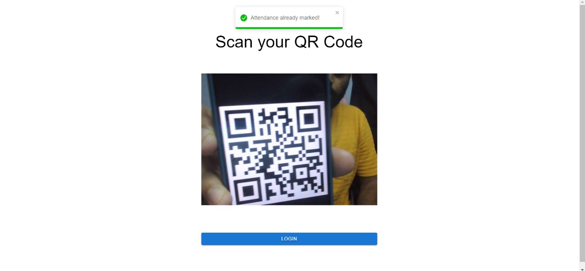

<h2 align='center'>Attendance Management System</h2>

---

<p align='center'>

</p>

## 📷 Link to [Screenshots](./SCREENSHOTS.md)


## 🧾 Description
Attendance Management System is a Web application, and it will work for a particular institute whose admin has created  an account for the institute. The software is also usable in offices for check-in and checkout entries. It can be extended to multiple branches or buildings of the same office.

## ✨ Features

#### User

- [x] The user enters their attendance by scanning their QR code.
- [x] User can login into the user panel with their valid credentials.
- [x] They can view their attendance on the user panel.

#### Admin

- [x] The admin can login to the admin panel.
- [x] The admin can view today's attendance details.
- [x] The admin can add, update, or remove users.
- [x] The admin can view/update his profile.
- [x] The admin enters the user's ID and views the user's record.
- [x] The admin can view the user's attendance percent.


**Here is a table dipicting the admin privileges for better clarity**

<table>
<thead>
  <tr>
    <th> </th>
    <th colspan="4">Admins</th>
    <th colspan="4">Users</th>
  </tr>
</thead>
<tbody>
  <tr>
    <td></td>
    <td><b><u>view</u></b></td>
    <td><b><u>create</u></b></td>
    <td><b><u>update</u></b></td>
    <td><b><u>delete</u></b></td>
    <td><b><u>view</u></b></td>
    <td><b><u>create</u></b></td>
    <td><b><u>update</u></b></td>
    <td><b><u>delete</u></b></td>
  </tr>
  <tr>
    <td><b>Priviledges</b></td>
    <td>✔</td>
    <td>✔</td>
    <td>✔</td>
    <td>✔</td>
    <td>✔</td>
    <td>-</td>
    <td>-</td>
    <td>-</td>
  </tr>
</tbody>
</table>

## ⚙ Tools and Technologies used

#### [Client](./frontend/)

1. [React.js](https://reactjs.org/)
2. [Material-ui](https://mui.com)

#### [Server](./server/)

1. [Node.js](https://nodejs.org/en/)
2. [Express.js](https://expressjs.com/)
3. [MongoDB](https://www.mongodb.com/)

## 🛠 Installation and setup

1. Clone the repo to your local machine.

    ```bash
    git clone https://github.com/varunKT001/ams-group-8.git
    ```

2. Install the required dependency for server using :

   ```bash
   npm install
   ```

3. Install the required dependency for the client using :

   ```bash
    cd frontend
    npm install
   ```

4. Create a `.env` file and copy-paste the contents of `.env.sample` in it.

5. Start the development server using :

   ```bash
   npm run dev
   ```

## 🏎 Creating production built

1. Create a production ready react app using the command:

    ```bash
    cd frontend
    npm run build
    ```

2. Run the server:

    ```bash
      npm start
    ```

## 🤝 Test admin credentials

| **E-mail**          | **Password** |
| ------------------- | ------------ |
| varun@ams.com       | varun1212    |
| ansh@ams.com        | varun1212    |


## 😎 Team Members

<table>
  <tr> 
    <td align="center">
      
      <br/>
      Ansh Rusia
      <br/>
      2020IMT-012
      <br/>
      <a href="https://github.com/anshrusia200">Github</a>
    </td> 
    <td align="center">
      
      <br/>
      Samarth Garg
      <br/>
      2020IMT-085
      <br/>
      <a href="https://github.com/SamarthGarg09">Github</a>
    </td>
    <td align="center">
      
      <br/>
      Shubhajeet Pradhan
      <br/>
      2020IMT-097
      <br/>
      <a href="https://github.com/shubhajeet1207">Github</a>
    </td>
    <td align="center">
      
      <br/>
      Varun Kumar Tiwari
      <br/>
      2020IMT-112
      <br/>
      <a href="https://github.com/varunKT001">Github</a>
    </td>  
  </tr>
</table>
